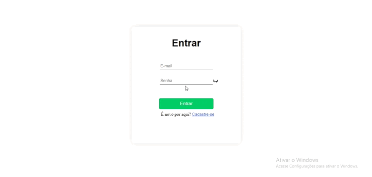

<h1 align="center">🤖 Fullstack App</h1>

<h2 align="center">👁‍🗨👁‍🗨</h2>
<h3 align="center">📸Screenshot</h3>
<p>
<h1 align="center"></h1>

## `Sobre`
Aplicação fullstack para cadastrar posts. O frontend foi criado com Reactjs e backend com Nodejs e banco de dados MYSQL, para criar o sistema de login utilizei o  [JWT JsonWebToken](https://www.npmjs.com/package/jsonwebtoken).

* `Pincipais bibliotecas utilizadas no backend`
    * [bcrypt](https://www.npmjs.com/package/bcrypt)
    * [express](https://www.npmjs.com/package/express)
    * [jsonwebtoken](https://www.npmjs.com/package/jsonwebtoken)
    * [mysql2](https://www.npmjs.com/package/mysql2)
    * [sequelize](https://sequelize.org/)

* `Pincipais bibliotecas utilizadas no frontend`
    * [Axios](https://www.npmjs.com/package/axios)
    * [jwt-decode](https://www.npmjs.com/package/jwt-decode)
    * [sass](https://sass-lang.com/install)
    * [sweetalert](https://sweetalert.js.org/guides/)
    * [yup](https://www.npmjs.com/package/yup)
---

### `git clone`

* **Faça o clone do repositório utilizando a linha de comando abaixo:**
```
git clone https://github.com/AAndersonSantos/fullstack-app.git
```

### `backend`
* **Entre na pasta `backend` e utilize a linha de comando abaixo para fazer o download de todas as dependências necessarias para que o projeto funcione corretamente**
``` 
npm install
``` 

### `frontend`
* **Entre na pasta `frontend` e utilize a linha de comando abaixo para fazer o download de todas as dependências necessarias para que o projeto funcione corretamente**
``` 
npm install
``` 

### `banco de dados mysql`
* Conecte o backend ao banco de dados mysql, entre na pasta database/config/db.config.js e coloque os dados nescessarios para fazer a conexão com o seu banco de dados. Depois de criar sua base de dados no mysql, entre na pasta database/models/posts descomente a linha 47 `postsdb.sync({force: true})` para criar as tabelas automaticamente. Faça o mesmo no database/models/users.js.

### `.env`
* Crie um arquivo com o nome .env na pasta backend e copie os valores que estão no arquivo .env.example e cole no arquivo .env então atribua um valor a PORT e ao SECRET_KEY. 
---

### `Executando o backend`
* Depois de realizar todas as configurações nescessarias entre na pasta backend e excecute o comando `npm start server.js` 
* O backend vai executar na porta 8081 configurado no arquivo .env ou na porta 8080.
---

### `Executando o frontend`
* Depois de realizar todas as configurações nescessarias entre na pasta frontend e excecute o comando `npm start` ou `yarn start` 

* O frontend vai executar na porta [http://localhost:3000](http://localhost:3000)

---

<h3 align="center">Criado por🤖Anderson Santos</h3>